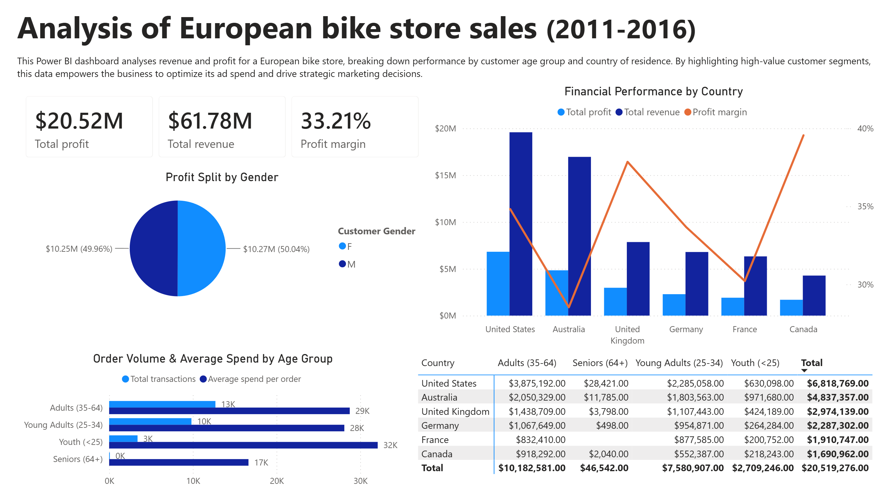

# Bike-sales-sql-powerbi
An interactive Power BI data pipeline and dashboard analyzing performance metrics for a European bike retailer to drive strategic marketing and ad-spend optimization.

## Dashboard Preview

## Project Overview

### Key business questions addressed

## Data Source and Infrastructure
**Data Set:** Bike store sales in Europe https://www.kaggle.com/datasets/serhatabuk/sales-data-csv 
**Database Engine:** postgreSQL, Data Grip
**BI Tool:** Power BI Desktop

### Data engineering pipeline

